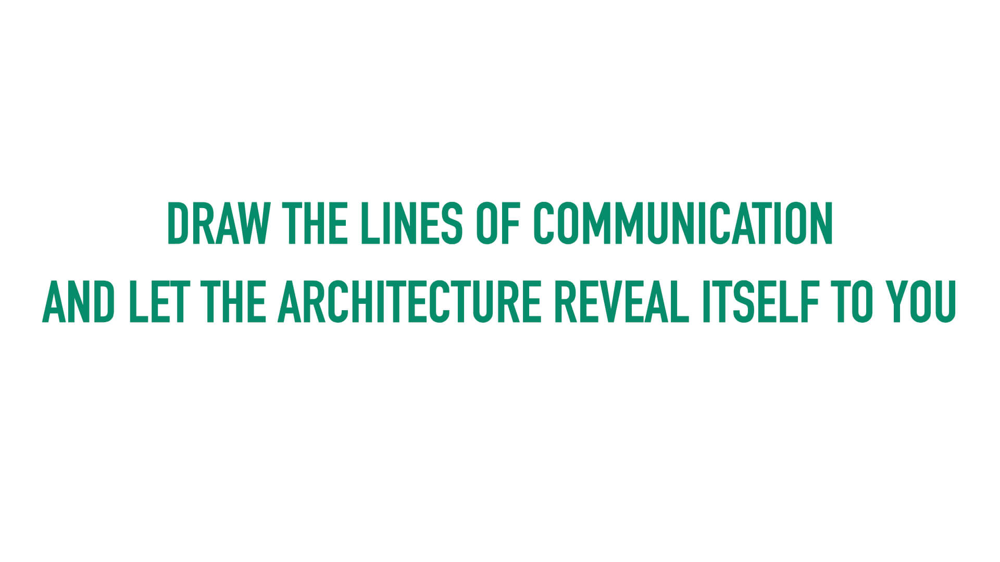

import YouTubeEmbed from "../../../../../components/YouTubeEmbed";

I recently joined the [LonghornPHP conference][LonghornPHP] as both an attendee, and a speaker. I learned a lot of great things, and I really enjoyed the keynote by [Tim Lytle].

I had the privilege of presenting on [co-location][Kent Dods on Co-Location]. What is co-location? Well, I'm glad you asked. Embedded is a video of the presentation I gave. Below the video is my presentation in text form (adapted slightly to fit the text format). So you can pick your preferred format, or do both!

<YouTubeEmbed youTubeId="2dMd0eyeptg" />

## Let's Be Better Engineers

I've made it my goal for as long as I've been a software engineer to become better and better at my craft and what I do. I am not content with reaching a certain level and staying there. I don't like the feeling of coasting. I hope that's a goal everyone shares. That's really what these concepts are about. I've spent the last ~20 years honing my craft and I have some thoughts, ideas, opinions, and suggestions. This post represents but a handful of those things.

## Code Comments

As we start walking down this path, I want to start off by thinking about code comments.

Now, I _could_ talk about the purpose of code comments. I could say that you should comment the "why" of your code and not the "how." I could spend time talking about how you shouldn't clutter your code with needless comments. I might then dive into code comment philosophy and talk about keeping your code comments fun and casual, but brief and to the point. But I don't want to talk about any of _that_ (although, as you can see, I have opinions on the subject).

Instead, I want to talk about where code comments belong and why they belong there.

I suspect you probably haven't given a lot of thought to why you put code comments where you do because they're pretty intuitive to be honest. But let's interrogate that for a minute.

Do you put code comments in one big documentation file? Or do you put them in a docs directory with a file structure that mirrors the file structure of the class or function or whatever that you're working on? Do you put all code comments on the company wiki, Jira, Confluence, your ticketing system, what have you?

I do hope those thought experiments sound silly to you. They're supposed to.

Code comments are best and most helpful when they are co-located with the code being commented upon. "Of course," you say. It's silly to think otherwise. And you're right! But why is that? It's so intuitive we don't stop to think about it. But here are a few reasons:

1. Ease of use while writing or updating code. The code comments are right there and can't be missed.
2. If the code comments aren't right there with the code, how would we know they exist at all?
3. If we have to maintain a mental model of where code comments go for a particular bit of code, what comments might be available, where to go to write comments, we're really just adding a mental tax to our ability to reason about our code. And then, even if we know comments exist somewhere, how do we go about finding them when we go to update the code?
4. How would separated code comments get maintained over time when you can't see them right with the code you're working on?

Code comments inline with the code makes things simple, easy to use, and easy to maintain.

## Organizing By Technical Concern

Given the title of this post, I hope you're starting to get a sense of where I'm taking this. Things that go together, should, well, go together. But before we talk more about that, I want to explore the more common convention in PHP and discuss what I see as the shortcomings of that approach.

By far, the most common convention for code organization that I've seen over the last 15 or so years is to organize by technical concern. I've inherited many PHP code-bases over the years, and they've all been organized in this fashion.

And if you look at the common conventions of PHP projects and framework recommendations over the last many years, you can see that developers have had a tendency to organize their code by technical concern. And why is that? It's become those technical concerns are quickly apparent to us and to framework designers when no other concerns are known about an application and its needs.

I would also say this is particularly true for those who know less about systems design and maintenance. But we sure do know a lot about language features, classes, services, etc.

So often, PHP projects will have a namespace for controllers, a namespace for models, a namespace for services (whatever those are), a namespace for views (again, whatever those are, though they tend to be template files in, say, the Laravel world).

Of course, the dividing line between a model, a service, or a controller can all get pretty fuzzy and vague. I love to draw boundaries around vagaries, but we can't start doing that until we understand that the conceptual model around which we're trying to draw boundaries in this paradigm is an unhelpful one. I believe that it pushes us in directions that make our code harder to understand, more prone, and harder to change overtime — which is the biggest problem when considering this pattern.

Organizing by technical concern encourages us to cross boundaries in our namespaces all the time to get what we need to get the job done. And this is because the boundaries we've drawn are meaningless, architecturally speaking. I'd wager, in fact, that you don't even think about the organization of your code as drawing boundaries. You simply think of it as some way to put things somewhere in the system. So when a "controller" needs to get a service or 10 from the "services" namespace to do its job, we cross that boundary and get it without batting an eye. And in this way, we've trained ourselves that boundaries are meaningless.

Organizing by technical concern is as if you went into a library and all the books were organized by color. If you want a red book, you have to go to the south wing of the library. If you want a blue book, those are on the east wing. And gray books are on the upper level.

Those are obviously not very helpful ways to organize books [^1], so what if, instead, we organized books by size? 4x8 books are on the lower level and 6x9 books are on the upper level.

That's also obviously unhelpful. When you're looking for a book, you care about concerns other than color or size. You might be interested in genre, author, title, etc. The same is true for our code. When you need to work on a feature, you'll have a hard time finding all the components of that feature if they're all organized by a different concern.

### Houston, we have a problem

As I started coming up through the ranks as a software engineer, I, like many, become quite opinionated about how code should be organized. And that was along those technical lines, because that's what I knew and that's what I was taught. But over time, as I started working on larger and larger projects more often, I found it became more and more difficult to work on isolated features of systems.

And so I started asking, why are we organizing our code this way? Why do we separate our code along technical lines? What's the advantage of doing so? How is this helping us? And I could not come up with satisfactory answers to those questions.

That's a difficult position to be in. Everyone I looked up to and respected in the PHP community organized by technical lines and I don't like to go against the grain. So I started looking around at other communities and other ways of doing things.

So, I'm not the first person to talk about this, and none of these ideas originated with me specifically. I'd even say, these days, more people in the PHP world _are_ asking these questions. But at the time I didn't know of any.

## Locality of Behavior

So what can we do instead? If we're not happy organizing by technical concerns, what principle should guide us on this journey into the unknown? What can we possibly do instead?

> The primary feature for easy maintenance is locality: Locality is that characteristic of source code that enables a programmer to understand that source by looking at only a small portion of it. — [Richard Gabriel][Richard Gabriel on Locality]

Richard Gabriel is a retired software engineer who worked in Lisp, primarily. I believe this quote captures the heart of what I'm getting at. Locality is the thing that I didn't have in the codebases I was working on that I desperately wanted. How do we get it?

The way forward is to organize our namespaces by "use case" or "business case" rather than technical lines.

- This allows for the locality Richard Gabriel described by creating logical, well-defined boundaries
- "Use cases" are about how users interact with a system
- "Use cases" allow the system to be broken into logical components
- "Use cases" are designed around features and system capabilities
    - Again, from the standpoint of the end-user of the system
- It should be noted that the end-user can be
    - a human (computer or mobile devices, etc.)
    - a machine (a cron job, a scheduled job, etc.)
    - or both

So how can we become better engineers? That's the question before us. I'd argue that in order to become great software engineers — in order to level up and be a cut above — we need to learn how to draw good boundaries.

I started out drawing those unhelpful boundaries around technical concerns because I could easily understand those sorts of distinctions (or so I thought) in my inexperience with how systems work and what's needed to maintain them.

But I found that in order to grow as an engineer, I had to start thinking deeply about the flow of code and how applications actually do what they need to do. To be great at what I do, I had to learn how to draw good boundaries.

I found that drawing boundaries around technical lines actually became a huge hindrance to writing good software because it's an unhelpful abstraction just like organizing books by color or size would be for libraries. It does not help with the mental model of how an application actually works.

## Good Patterns

Now, I'm a PHP guy, but I want to take a step back for a minute and talk about some front-end code. I am a full stack engineer and I write code all over the stack. Specifically, I want to talk about [React].

I avoided React for many years, despite its rising popularity. I finally had to cave when the technology we chose to re-build the front-end of a flagship application was React. It turns out React is really amazing for web applications. Further, I find React has revealed some patterns that may be relevant to us all.

It turns out that keeping related things as close together as possible reduces complexity and decreases mental overhead. And with modern Javascript frameworks, a byproduct has been that related things are kept together.

But let me back up even further to when I started using [Tailwind CSS]. I was already well down this road of thinking with PHP, but I hadn't fully made the turn nor did I completely grasp the significance of this paradigm shift to apply it to my thinking on the front-end as well.

I balked at Tailwind at first. "Isn't this just inline CSS? And, after all, we all know inline CSS is bad!" But as I slowly gave in, I discovered something. It became apparent to me that what Tailwind provides is a way to keep all the related bits of a component in one place — co-located together. With Tailwind, there's no more hunting down CSS for the HTML you're working on, it's right there. There's no more worrying about whether I can or should delete CSS declarations because it's all right with the component inline.

I had the "eureka" moment with Tailwind that it was exactly what I was pursuing on the PHP side. So as you can imagine, when I started using React, I used it with Tailwind and everything clicked into place. Now ALL the things related to each other were in the one place: HTML, CSS, and Javascript.

Of course, with React, you can import components from anywhere in your filesystem, so you could still get this wrong, but that's not the encouraged way in React. And certainly on my team, when we build the pieces of the front-end that make up the apps, we keep everything together. If we need a custom hook, or a subcomponent, we'll create those files in the same directory as the parent. If something ends up being useful in more than one place, perhaps we'll carefully consider and move it up a level. But even that is done carefully (we don't want to introduce complexity through hasty abstractions to de-duplicate [incidental duplication]). So in this way, we maintain locality of our front-end components.

Coming up through the front-end world in the mid to late 2000s, we all got quite a dose of the "separation of concerns" mantra. Specifically, that HTML, CSS, and Javascript should all be kept separate because you _don't_ want to mix those concerns. Ever. And I believe this. I even _taught_ it to new hires and younger engineers in the early 2010s.

The problem is, we have to think more carefully about what concerns should be separated, and what are the concerns. When you start approaching your code from a "use case" or "business case" point of view, you suddenly realize that what you have with HTML/CSS/JS are not 3 separate concerns, but 3 technical aspects of the same concern where HTML provides the structure, CSS provides the styling, and Javascript provides the behavior, all the with the goal of empowering the use case that's in view.

So what I and my team discovered when we started building front-ends in React is that thing Richard Gabriel called "locality."

## Applying a heuristic

How can we apply all this specifically to the more back-end side of the code? How can we re-think how we organize our code along usage or business lines and not technical lines?

I'm going to give you a simple heuristic that I have found immensely helpful in this journey. It still helps me. I still apply this heuristic whenever I'm adding or updating a feature. I push this heuristic as the leader of my team as my predecessor did.

You may have heard of the idea that "things that change together go together." And that's a perfectly fine idea. But I think to get at the heart of it, the heuristic we can apply is, "is this thing easy to delete?"

In other words, does it have tendrils so deep into the rest of the codebase that deleting it would be a real slog? Whether you would ever actually delete the thing you're building or not is immaterial. What we're after here is the mental exercise, which is, I would argue, the approach that leads to far better architecture and code quality.

Another way you can ask the question is, "what is the blast radius of the thing we're adding to this app?"

The result is carefully encapsulated and contained pieces, with 1 or 2 tendrils into the outside world that make up the application. This is the co-location of related things.

## Microservices?

You probably remember microservices? That old idea that took off in the 2010s? I jest… a little. But it really was a craze that has died down into a more proper placement by now. You may be employing them to one degree or another. I survived the craze, and I currently work on an app that started down the microservices route. I would argue that it was split up along unhelpful lines, but the thinking is not entirely without merit.

Now, I would argue that most apps don't need 50 microservices. I find that to be way too much separation for the vast majority of cases. Most things need 2 or 3 larger services at most. And when you have only 2 or 3 services for your application, you don't have to deploy 8 microservices to make a single coordinated change. And if you need to scale performance, there's load balancing, primary and secondary mysql servers, etc. But I digress…

The point is, some of the thinking behind microservice is worth exploring. A lot of what we were doing there wasn't a bad thing.

One of the ideas was to draw boundaries and co-locate related things together in one place, and then to contain them to that one place.

And what I've been describing is a way to do that, but within one application, not many microservices. What we want to do is draw good boundaries within the application or project.

So having laid out a lot of the philosophy behind co-location rather than technical concern, I don't want to just leave it there. I'd like to dive into some more specific examples.

## A Specific Example

Organizing by use case is sort of like microservices within one application. What we're doing here is creating boundaries around a use case for the application. In PHP, I tend to draw those use case boundaries at the top level of my `src` directory.

When we organize this way, it should make us think very deeply about boundaries and dependencies [^2] as we design these "microservices" within our application in a way that makes sense together.

And when we organize this way, we should be able to jump into a project and start to comprehend it right away easily and quickly at a high level.

For the purposes of this topic, I've [created a small, simple little notes/todo application demo][Demo App]. It's not a feature-rich app. I would not even call it deployable in its current state. It lacks niceties. I created it in about 1.5 days. But I wanted to create something simple to demonstrate the thinking behind co-location that you could easily dive into. This is just to give you a taste and to help you get the gears turning.

It's a PHP app with a little tailwind sprinkled on top. You can clone it and run it on your own computer, inspect the code, etc.

There are two main features in this app: todos and notes.

As we start to dive in to how this application is organized, note the comprehensibility right way. You can see a couple of technical concerns at a high level: Authorization and Persistence. And that's okay. Apps are technical, and they're going to have technical use cases. Note that I'm treating them as use cases and that their related things aren't scattered across the known universe.

Now let's imagine you've been put on this project, and you've never seen this application before. You've been given a bug fix for the Notes feature. Where do you go to work on such a feature?

I can't pause for dramatic effect in a text post the way I can when presenting this to a live audience, but pretend I did…

As you can see, it's not a trick question. You go to the `Notes` directory. Everything to do with the Notes feature is right there in the `Notes` directory. And it's pretty self-contained. The tendrils to and from the world outside the `Notes` directory are limited. Somewhat repeatedly to my footnote on dependencies, they are also provided. Nothing in this directory reached out to get what it needs via [service location][Service locator: an anti-pattern] or anything like that. Dependencies are declared in constructors to be provided by the DI Container, or via routing and request objects. You might recognize this as the "[inversion of control][Martin Fowler on the Inversion of Control Principle]" principle.

Let's dive in just a smidge and look at the class that receives the incoming HTTP request to list the notes: `\App\Notes\GetNotesListAction`.

As we look over the class, we can easily see the tendril coming in from the outside world as the `$request` object in the `__invoke` method argument. In that way, we see that it accepts an incoming HTTP request. This is an entry point from the outside world — a tendril, if you will. Because we're declaring that we need that request object and we know we need to know a little about the outside world here, we get from that request the things we need.

This HTTP action collects that information, dispatches a request to the more inner workings of the Notes feature, gets back what it needs, passes some information to a template to be rendered by a template engine, and returns that output as the `ResponseInterface` body.

Because everything else is happening within the `Notes` boundary, you have just, at a very high level, comprehended the Notes Listing feature of the application.

So then, what if you needed to work on adding a note, where would you go in that directory structure? Here it is again for reference:

Once again, it's not a trick question. In the way I've organized this application, it's very clear that where you would go is the `Add` directory. I've considered that a sort of "sub" use case of the `Notes` feature.

I won't go over every little detail of this little demo app, you are welcome and encouraged to do that on your own. But I think you can start to see the organizational principles at work as well as the intentionality of the boundaries. Very little in the `Notes` namespace depends on the outside world.

And to line this up with our heuristic: if you would like to delete the notes feature, just remove that namespace and everything in it, then remove that one little tendril leading to it by removing the HTTP route. Then, _poof_, it's gone.

You may also want to drop the database table that stored the notes, but that's entirely up to you.

## Separation of Concerns

I'm not normally a mind-reader, but I can almost hear all the thoughts of my readers out there emanating in my direction. And those thoughts are going something like this, "what about separation of concerns?"

Separation of concerns is a very good thing to think about. It is, I would say, a fundamental, core principle of good software design. However, as you might guess by now, I think we need to revisit what concerns need to be separated. What are the useful separations that drive better behavior, easier maintenance, and higher code quality? And what are the useless and even harmful separations that, at best, serve no purpose, and at worst drive poor software design?

If we diagram separating "concerns" by their technical nature, I think we can get a clear sense of just how meaningless these separations are. Conceptually, things are pretty messy here. Boundaries mean nothing because the organizing principle is an unhelpful one, just like organizing books by color in a library.

And look at just how often those boundaries are crossed. We jump to a new boundary at pretty much every conceivable point in the application flow. And because we've drawn these meaningless distinctions, we can't actually draw meaningful distinctions. We don't even see the lines we've drawn as boundaries and they've become distinctions without a meaning.

For the next diagram, we're going to, instead, draw the lines of communication and let that reveal the architecture to us. In order to draw good boundaries, we have to ask, "what elements are constantly talking to each other to get the job done?"

In this diagram, everything gets a lot clearer. You can see those tendrils into the boundary, then all the communication happens within that boundary. All the related elements are kept together with that namespace drawn around them. And we can see the other boundaries floating around out there, but we don't care about those right now because we're working within the relevant namespace to our feature or use case.

And in this model, because we've drawn good boundaries, the need to cross the boundary should now stop and make us think, "should I really cross that boundary?"

I hope you remember this proposition from the beginning: that we want to become better engineers. So the question is, can all this make us better engineers? Isn't this just technical preference stuff? Suzie prefers to organize her code along usage lines, but Bobby prefers to organize his code along technical lines. And isn't that all it is? A preference?

It should be obvious by now that I think boundaries and encapsulation are a big deal. I'd say, in fact, that learning to draw good boundaries is when I went from a mid-level engineer to a senior+ engineer.

You know the old joke that there are 2 hard things in computer science, 1. naming things, 2. cache invalidation, 3. off by one errors. Well, naming things is hard, and what is naming things except declaring what something is and what something is not. It's drawing clear boundaries. And what I'm proposing here is that we need to expand our concept of naming things beyond just that final segment of the namespace. We need to be declaring good boundaries by naming things well with all the segments of the namespace.

As a mid-level engineer, I threw all the classes of a certain technical category into a namespace for that category. But that is far from scalable and doesn't encourage us to think about our software and how it's organized for long-term stability and maintainability.

An additional heuristic we can apply as we look at those diagrams is, "can a non-technical person understand the boundaries by their names?" Whether a non-technical person ever would look at the code is immaterial to the exercise. What we're after here is comprehensibility. There's a sense in which the machines running the code don't care about the organization of our code. That's why we talk about comprehensibility. Source code is about us and how we can read it and maintain it as humans. And so it's about making us better engineers.

Drawing boundaries in unhelpful places encourages thinking about our code in the wrong kinds of units — units that don't make sense to the business of the application or the real world use cases.

Conversely, drawing boundaries around use cases is a much more helpful way to think about your code and its flow. We're drawing distinctions in functionality and purpose in a way that aligns more closely with the work we're doing at the moment, it encourages encapsulation of responsibilities that make sense, and makes features easy to maintain and easy to delete.

So ask these instigating questions the next time you start a new feature:

1. Where is the real, meaningful boundary for this thing?
2. Is it easy to delete?
3. Can a fresh developer walk into the project and understand the codebase?

Diagram those lines of communication, even if it's just in your head. Elements that are constantly talking to each other to get their jobs done probably go together.

You can find the [sample app here][Demo App].

[LonghornPHP]: https://www.longhornphp.com/
[Tim Lytle]: https://twitter.com/tjlytle
[Kent Dods on Co-Location]: https://kentcdodds.com/blog/colocation
[Richard Gabriel on Locality]: https://htmx.org/essays/locality-of-behaviour/
[React]: https://react.dev/
[Tailwind CSS]: https://tailwindcss.com/
[Incidental Duplication]: https://www.tjdraper.com/blog/incidental-duplication/
[Demo App]: https://github.com/buzzingpixel/todo-app-example
[Service locator: an anti-pattern]: https://stitcher.io/blog/service-locator-anti-pattern
[Martin Fowler on the Inversion of Control Principle]: https://martinfowler.com/articles/injection.html

[^1]: Unless, of course, you're an interior designer and use the color of book bindings for decor and the content of the book is irrelevant (my dear, bookish wife won't even hear of such a thing 😂). The point being, context and use case matter. So this really just bolsters my argument.
[^2]: Dependencies are not an unrelated topic, but more than I'll have time to cover here. Perhaps in the future.
